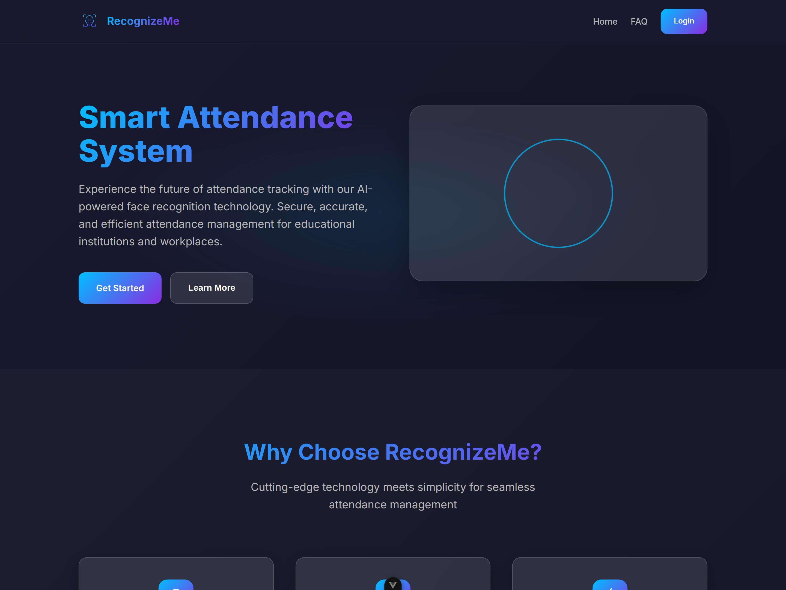
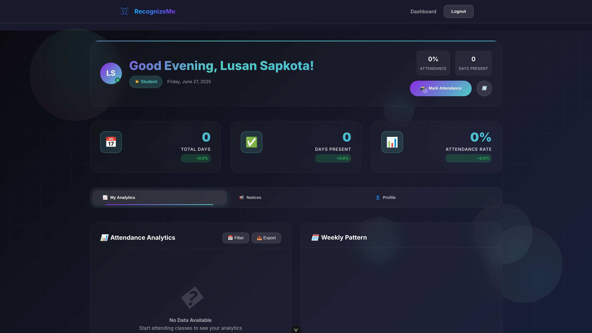
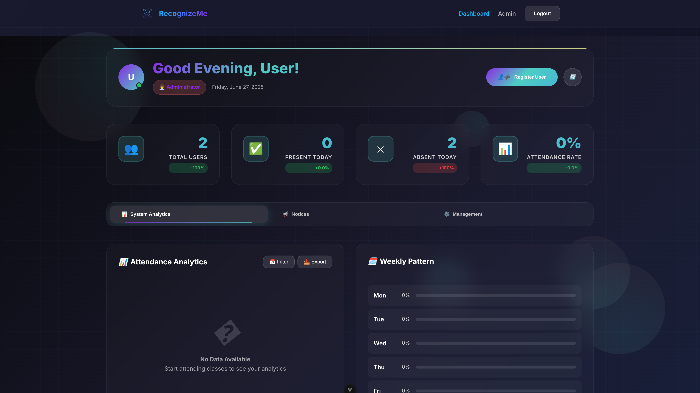
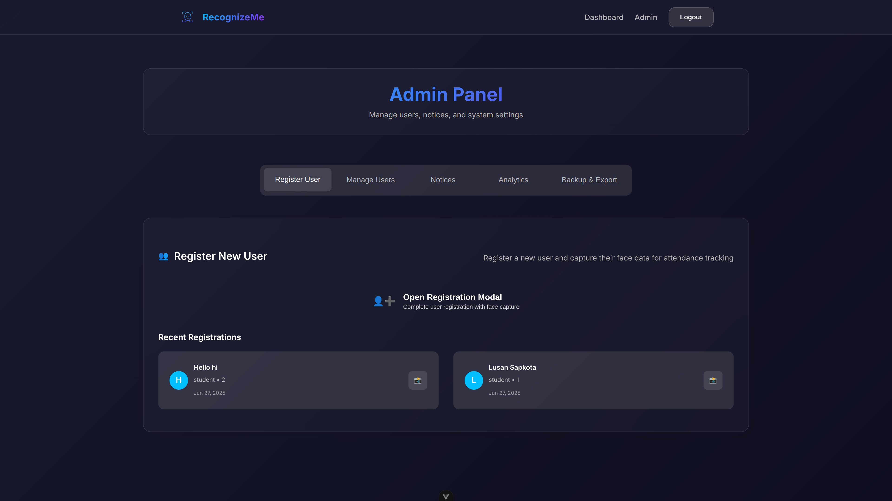

<div align="center">

# 🚀 RecognizeMe
### *AI-Powered Facial Recognition Attendance System*


[](https://www.python.org/downloads/)
[](https://vuejs.org/)
[](https://www.typescriptlang.org/)
[](https://flask.palletsprojects.com/)
[](https://opencv.org/)

[](https://www.gnu.org/licenses/agpl-3.0)
[](https://lusansapkota.com.np)

---

### 🌟 *Revolutionizing attendance tracking through cutting-edge AI and computer vision*

*Built entirely from scratch with passion, precision, and the latest machine learning technologies*

</div>

**RecognizeMe** is an intelligent, machine learning-powered attendance management system that leverages cutting-edge computer vision and deep learning algorithms to automate attendance tracking through advanced facial recognition technology. Designed and built entirely from the ground up with modern AI frameworks and neural network architectures for maximum accuracy and performance.

> 💡 **Personal Achievement**: This entire project was crafted from scratch, combining my passion for AI, computer vision, and full-stack development to create a production-ready solution that pushes the boundaries of attendance management technology.

---

## ✨ Why RecognizeMe?

| 🧠 | **AI-First Approach** | Built with machine learning at its core, not as an afterthought |
|:---:|:---|:---|
| ⚡ | **Lightning Fast** | Real-time face recognition with sub-second response times |
| 🔒 | **Enterprise Security** | Multi-layered authentication with biometric verification |
| 📊 | **Intelligent Analytics** | ML-powered insights and predictive attendance patterns |
| 🎨 | **Modern Interface** | Intuitive design crafted for exceptional user experience |
| 🚀 | **Production Ready** | Scalable architecture designed for real-world deployment |

## 🧠 AI-Powered Features

### 🎯 Core Machine Learning Capabilities

- **Deep Learning Face Recognition**: Advanced convolutional neural networks for precise facial identification
- **Computer Vision Processing**: Real-time face detection using OpenCV's Haar cascades and DNN modules
- **Intelligent Attendance Analytics**: ML-driven insights and predictive attendance patterns
- **Neural Network Training**: Automated model training with facial embeddings and feature extraction
- **Smart Authentication**: AI-enhanced secure login with biometric verification
- **Adaptive Learning**: Continuous model improvement with new facial data

### 📊 AI-Enhanced Admin Features

- **Predictive Analytics**: Machine learning insights for attendance forecasting
- **Intelligent User Management**: AI-assisted user registration with facial feature analysis
- **Smart Notifications**: Algorithm-driven announcement system
- **Data Intelligence**: Advanced reporting with ML-powered trend analysis
- **Automated Backup**: AI-optimized database management and recovery
- **Real-time Monitoring**: Neural network-powered live attendance tracking

### 👤 Intelligent User Experience

- **Personalized Dashboard**: AI-curated individual attendance insights
- **Biometric Check-in**: Lightning-fast facial recognition attendance
- **Smart Notifications**: ML-filtered important announcements
- **Predictive Profiles**: AI-enhanced personal attendance forecasting
- **Intelligent History**: Machine learning-powered attendance pattern analysis

## 🤖 AI Technology Stack

### Frontend Intelligence

- **Vue.js 3** - Reactive framework for dynamic AI interfaces
- **TypeScript** - Type-safe development for ML applications
- **Vite** - Ultra-fast build tool optimized for AI workflows
- **Pinia** - Intelligent state management for ML data
- **Vue Router** - Smart navigation for AI-driven UX

### Backend Machine Learning

- **Flask** - Lightweight framework for AI microservices
- **OpenCV** - Advanced computer vision and image processing
- **scikit-learn** - Production-ready machine learning algorithms
- **NumPy** - High-performance numerical computing for AI
- **SQLite** - Optimized database for ML model storage
- **JWT** - Secure token-based authentication
- **bcrypt** - Cryptographic password protection

## 📋 Prerequisites

Before running this application, make sure you have:

- **Node.js** (v16 or higher)
- **Python** (v3.8 or higher)
- **pip** (Python package manager)
- **Camera/Webcam** (for face capture and recognition)

## 🚀 Installation & Setup

### 1. Clone the Repository

```bash
git clone https://github.com/lusansapkota/Face-Recognition-Based-Attendance-System.git
cd Face-Recognition-Based-Attendance-System
```

### 2. Backend Setup

#### Navigate to backend directory

```bash
cd backend
```

#### Create virtual environment

```bash
python -m venv venv

# On Windows
venv\Scripts\activate

# On macOS/Linux
source venv/bin/activate
```

#### Install dependencies

```bash
pip install -r requirements.txt
```

#### Set environment variables

Create a `.env` file in the backend directory:

```env
SECRET_KEY=your-secret-key-here
ADMIN_PASSWORD=admin123
```

#### Run the backend server

```bash
python app.py
```

The backend will start on `http://localhost:5000`

### 3. Frontend Setup

#### Navigate to frontend directory (in a new terminal)

```bash
cd frontend
```

#### Install frontend dependencies

```bash
npm install
```

#### Run the development server

```bash
npm run dev
```

The frontend will start on `http://localhost:5173`

## 📱 Usage

### 🔑 Default Login Credentials

#### Admin Access
- **Password**: `admin123` (or as set in .env file - backend (do not expose in frontend))

#### User Access
- Users need to be registered by admin first
- Login with username/password provided during registration

### 🎯 Getting Started

1. **Access the application** at `http://localhost:5173`
2. **Login as admin** using the default password
3. **Register users** through the admin dashboard
4. **Capture face data** for each user for recognition
5. **Start taking attendance** using the face recognition system

### 📸 Face Recognition Setup

1. **Register User**: Admin creates user account with basic details (supported user types are student, staff, teacher)
2. **Capture Faces**: System captures multiple face images for training
3. **Model Training**: AI model trains automatically after face capture
4. **Recognition Ready**: Users can now mark attendance using face recognition

## 🎨 Demo

## 🎨 Demo & Showcase

### 📸 System Screenshots

| Home | Student Dashboard |
|:---:|:---:|
|  |  |

| Administrater Dashboard | Admin Panel |
|:---:|:---:|
|  |  |

### 🎥 Video Demonstrations

**Coming Soon!** 🚀

Preparing comprehensive video tutorials showcasing:

- 🎯 AI facial recognition in action
- 📊 Real-time attendance tracking  
- 🧠 Machine learning model training
- 📈 Advanced analytics dashboard
- ⚙️ Admin panel features

*Stay tuned for exciting demos of RecognizeMe's intelligent capabilities!*

## 🔧 AI Configuration

### Neural Network Settings

- Default camera resolution: 640x480 (optimized for ML processing)
- Face detection minimum size: 100x100 pixels (neural network input)
- Training images per user: 3+ (for optimal model accuracy)
- Face recognition confidence threshold: Configurable (ML model tuning)

### Security & AI Settings

- JWT token expiration: 24 hours
- Password minimum length: 6 characters  
- Face recognition confidence threshold: Configurable for ML accuracy
- Model retraining frequency: Automatic with new face data

### Database & ML Storage

- SQLite database for development and ML model storage
- Supports migration to PostgreSQL/MySQL for production
- Facial embeddings stored securely
- Model versioning and backup support

## 🚀 Deployment

### Production Build

#### Frontend

```bash
cd frontend
npm run build
```

#### Backend

Configure for production environment:

- Use production WSGI server (Gunicorn)
- Set secure environment variables
- Configure production database
- Set up reverse proxy (Nginx)

## 🤝 Contributing

We welcome contributions! Please see [CONTRIBUTING.md](CONTRIBUTING.md) for guidelines.

### Development Workflow

1. **Fork** the repository
2. **Create a feature branch** from `main`
3. **Make your changes** and test thoroughly
4. **Submit a pull request** with clear description

### Code Style

- Follow existing code formatting
- Write meaningful commit messages
- Add comments for complex logic
- Update documentation as needed

## 📝 License

This project is licensed under the **GNU Affero General Public License v3.0** - see the [LICENSE](LICENSE) file for details.

The AGPL license ensures that all derivatives and network-deployed versions of this AI-powered software remain open source, promoting collaborative development in the machine learning community.

## 👨‍💻 Author

### Lusan Sapkota

- 🌐 Website: [lusansapkota.com.np](https://lusansapkota.com.np)

## 📞 Support & Contact

### Get Help

- **GitHub Issues**: Report bugs or request features
- **Email**: Contact through [lusansapkota.com.np](https://lusansapkota.com.np)

### Documentation

- Check the wiki for detailed documentation
- Review code comments for implementation details
- See demo videos for usage examples

## 🙏 Acknowledgments

Special thanks to the open-source community and the incredible technologies that made this project possible:

- 🔬 **OpenCV Community** - For revolutionary computer vision tools
- 💚 **Vue.js Team** - For the amazing reactive framework
- 🌶️ **Flask Community** - For the lightweight yet powerful web framework
- 🤝 **All Contributors** - Every user who helps improve RecognizeMe

---

## 🚀 AI Development Roadmap

### 🔮 Upcoming ML/AI Features

| Feature | Status | Description |
|:---|:---:|:---|
| 📱 **Mobile AI Companion** | 🔄 | Cross-platform facial recognition app |
| 📊 **Advanced Predictive Analytics** | 📋 | Deep learning attendance forecasting |
| 🎯 **Multi-Camera Neural Networks** | 📋 | Distributed computer vision processing |
| ☁️ **Cloud AI Deployment** | 📋 | Scalable machine learning infrastructure |
| 📚 **API Documentation** | 📋 | ML model endpoints and AI service integration |
| ⚡ **Performance Optimization** | 📋 | Neural network acceleration and GPU support |
| 🔐 **Enhanced Biometric Security** | 📋 | Multi-modal authentication with AI |

### 📊 Version History

- **v1.0.0** - 🚀 Initial release with core ML features and neural network foundation

---

<div align="center">

### 💫 *Crafted with passion, powered by AI, built for the future*

**Made with ❤️ by [Lusan Sapkota](https://lusansapkota.com.np)**

*"Every line of code tells a story of innovation"*

</div>
